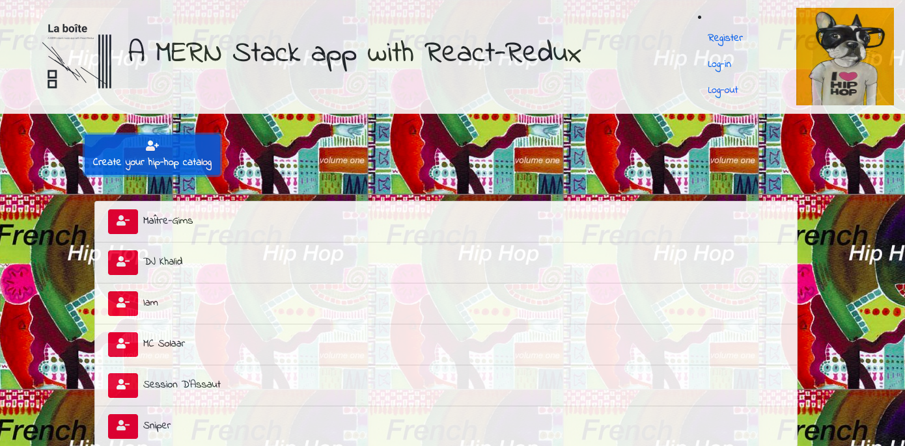

## La Boite is a Music app using React & React-Redux



- Redux lifts state from React class components and moves it as a single state object to the react-redux store
- While redux may not be the best method to handle state, the learning objective is to understand how state works for SPA's both with react class components and with react-redux as a more predictable container for state.


Adapted from Brad Traversy's tutorial Learn The MERN stack on You Tube [https://www.youtube.com/watch?v=5yTazHkDR4o&list=PLillGF-RfqbbiTGgA77tGO426V3hRF9iE&index=2&ab_channel=TraversyMedia

## Available scripts

- The package manager is npm - to clone ```npm init -y``` to install dependencies, run this 2 times once in the client-side folder and the second time in the server-side folder.
npm run start-dev - client server:port 3000/ backend-server:port 5000

Fix any outdated packages
- ```npm audit`` Fix manually or use auto
- ```npm update``` Fix with npm update packageName@version a better way to do this is npm install packageName@version
- ```npm uninstall``` @packageName for any packages you do not need as there could be many deprecated dependencies in the package so only use packages that your app really need.

This repo has been updated Dec 2020 (server and client side)

## SCAFFOLDING -server side (Node, Express, Mongoose)
- mkdir inventory-app
 * create a front-end folder (client)
 * create a back-end folder (server)

- npm install -D (as a dev dependency - not needed for production version)
- npm install -g (globally as needed even in production version)

**Express Server** 
npm install -D  express nodemon concurrently(server dependencies)
npm install -D cors dotenv path body-parser helmet express-rate-limiter(server-side security)

**MongoDB**
npm install -g  mongoose mongodb (database dependencies)

## SCAFFOLDING -client side (CRA-React-Redux)

- in the client directory ```npx create-react-app .```
- you can also create the app in the root directory and name the app client ```npx create-react-app client```

**Redux**
- npm install redux react-redux redux-thunk redux-devtools-extension

**External Libraries**
- npm install bootstrap reactstrap uuid react-transition-group
- npm install axios
In ```App.js``` file to include bootstrap add ```import 'bootstrap/dist/css/bootstrap.min.css';```

## Naming conventions
In the src files create frontend (client) and backend (server) folders to separate concerns Folder naming convention - camelCase for files and snake-case-for-folders


## VERSION CONTROL
Set up github repo and link local version

- git add .
- git commit -m'initial commit'
- git remote add origin - ssh key
- git push -u origin master
- Check out of master and create branches [git checkout -b branch-name]
- Set up first branch as development if you do not want to merge to master until deploy
- Set up next branch as debugging so that you can debug your code in this if you want to push to dev
- Check out of master and work from develop 
- Pull and push changes  to develop if you move to debugging branch for fixes and if working on multiple branches at the same time

